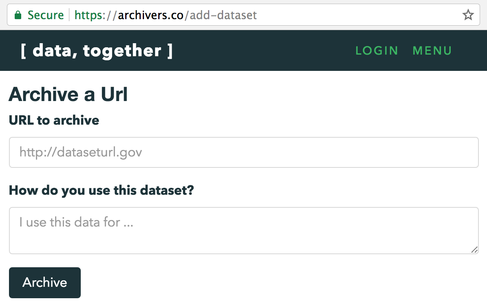

# Tutorial: Add a Dataset to Data Together

_Note: This tutorial is a work in progress. Please add your feedback to [datatogether/learning](https://github.com/datatogether/learning/issues)!_

## Prerequisites

* You care about a dataset that exists on the web -- that's it :)

## Learning Objectives

After going through this tutorial you will know how to:

* Add a dataset to Data Together for harvesting
* Create an account on Data Together
* Explain the difference between adding, harvesting, and storing datasets with Data Together
* Describe how Data Together helps groups to steward data they care about

****

### Step 1. Get information about a dataset

* Consider the dataset that you would like to archive on Data Together.
* Make note of the **name** and **web address** or [**URL** ](https://en.wikipedia.org/wiki/URL) where the dataset can be accessed.
* In addition but without spending too much time, make note of contextual information such as what you use the data for, why the data was collected (and by who), what date it was published.

An example would be EPA's National Greenhouse Gas Emission Inventory, currently located at https://catalog.data.gov/dataset/national-greenhouse-gas-emission-inventory.

### Step 2. Register on Data Together _(optional)_

* Register on Data Together by visiting https://archivers.co/signup

### Step 3. Archive a dataset on Data Together

* Copy the URL of the dataset you would like to archive
* Visit the Data Together [Add a Dataset](http://archivers.co/add-dataset) page
* Paste the URL into the "URL to archive" text box
* Type a simple description in your own words into the "How do you use this dataset?" text box
* Click the "Archive" button
* Success! You archived a dataset :)

### Step 4. Explore the concepts of data stewardship that underly Data Together

* **Public Record** means a shared record of the information that has been published by groups, organizations and other entities on the web.
* **Distributed Data Stewardship** means using distributed technologies to secure and provide access to data that people care about.

## Next Steps

Move on to the next tutorials to learn the following:

* [Replicate a Dataset](../replicate-with-control/README.md) you care about onto hardware that you control
* [Browse Datasets](../browse-datasets/README.md) that have been backed up

