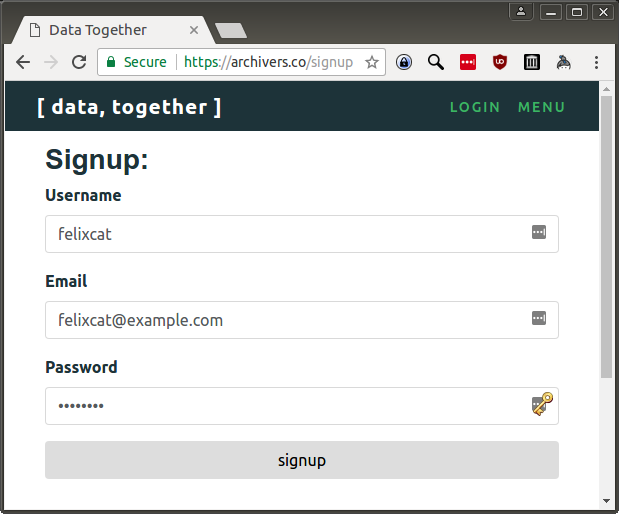

# Tutorial: Add a Dataset to Data Together

_Note: This tutorial is a work in progress. Please add your feedback to [datatogether/learning](https://github.com/datatogether/learning/issues)!_

## Prerequisites

* You care about a dataset that exists on the web

## Learning Objectives

After going through this tutorial you will know how to:

* Add a dataset to Data Together for harvesting
* Create an account on Data Together
* Explain the difference between adding, harvesting, and storing datasets with Data Together
* Describe how Data Together helps groups steward data they care about

## Key Concepts

* Public Record
* Data Together Nodes
* Distributed Data Stewardship

## Lessons

### Add an Important Dataset{#lesson-one}

#### Step 1. Get information about a dataset

Before you start you'll want to know a little bit about the dataset you would like to archive on Data Together. At a minimum this should include the **name** and **web address** or [**URL** ](https://en.wikipedia.org/wiki/URL) where the dataset can currently be accessed.

An example would be EPA's National Greenhouse Gas Emission Inventory, currently located at https://catalog.data.gov/dataset/national-greenhouse-gas-emission-inventory. 

#### Step 2. Register on Data Together

To register on Data Together, visit https://archivers.co/signup

 

#### Step 3. Archive a dataset on Data Together

* Copy the URL of the dataset you would like to archive
* Visit the Data Together [Add a Dataset](#) page
* Paste the URL into the "URL to archive" text box
* Type a simple description in your own words into the "How do you use this dataset?" text box 
* Click the "Archive" button
* Success! You archived a dataset :)

#### Step 4. Review the actions you can take on datasets

Adding, harvesting, and storing are all verbs used in Data Together to describe actions you can preform on datasets

* Adding a dataset means [...]
* Harvesting a dataset means [...]
* Storing a dataset means [...]

#### Step 5. Explore the concepts of data stewardship that underly Data Together

Data Together helps groups steward data they care about by [...]

## Next Steps

More tutorials to follow, including how to:

* Replicate a dataset you care about onto hardware that you control
* Browse datasets that have been backed up

Check back soon!
