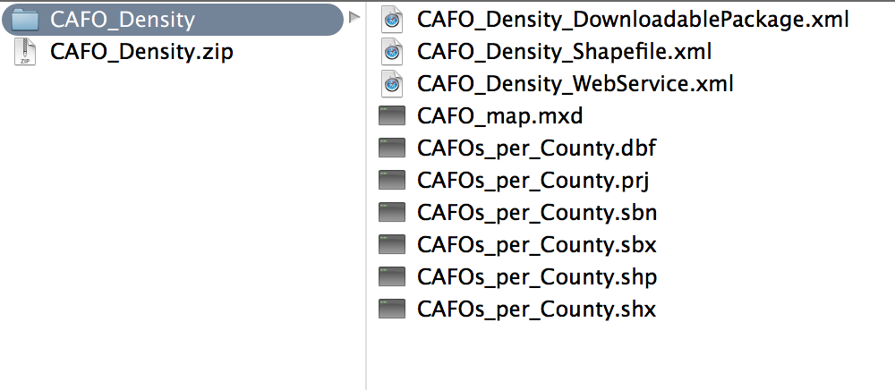
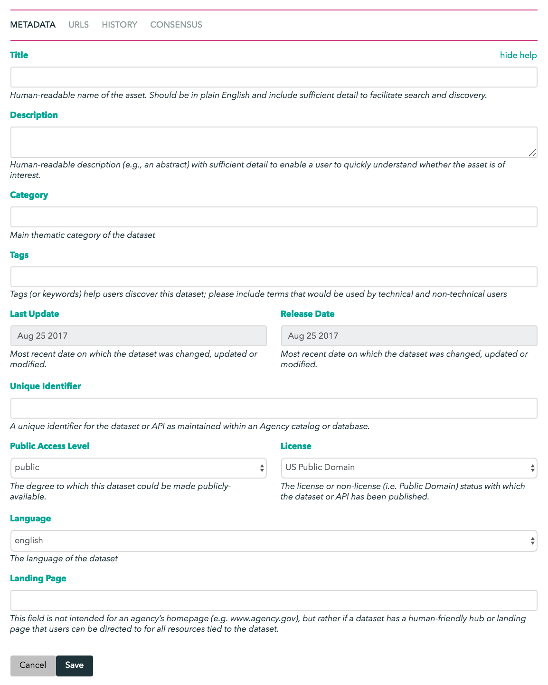

# Tutorial: Annotate content that’s already on the network

_Note: This tutorial is a work in progress. Please add your feedback to [datatogether/learning](https://github.com/datatogether/learning/issues)!_

## Prerequisites

* Some interest in data
* Optional (but valuable if you have it) domain expertise 
* Enthusiasm!

## Learning Objectives

After going through this tutorial you will know how to:

* Add metadata to data you care about

****

### Step 1. Add metadata

* Return to your web browser, and signup/signin to http://archivers.co/

* Navigate to the content page for `CAFO_Density.zip`: http://archivers.co/content/12208b35b5c819ef6a8bb5df4657acbed1fbf084f8efe3174b3896db0058d91e82e5

* Click the download button

* Temporarily leave the web browser (you'll be back in the next tutorial to add metadata) to locate the file you just downloaded onto your computer. Unzip it: 

>

* Browse the data to understand what it consists of. 
  * In this case, there's an XML file that contains metadata that we can start with. Great! If you have the additional ability to actually look at the data, which in this case would require geographic software like [QGIS](http://www.qgis.org/en/site/forusers/download.html) but in other cases might be a PDF or an XLS file, please do so. 
  * In this example, notice that this data contains EPA's counts of CAFOs per county for every state in the United States. 

* Return to the content URL metadata form online 

>

* Fill in to the best of your abliity, and press the Save button

## Next Steps
