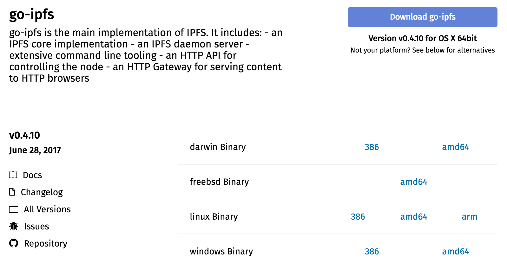

# Tutorial: Replicate a Dataset you care about onto hardware that you control

_Note: This tutorial is a work in progress. Please add your feedback to [datatogether/learning](https://github.com/datatogether/learning/issues)!_

## Prerequisites

* some familiarity with the command line
* enthusiasm!

## Learning Objectives

After going through this tutorial you will know how to:

* Install IPFS and check that it's working properly
* Get the hash of the data
* Check that you have enough storage space on your local machine
* Pin the data onto your machine

_**Note: this tutorial is written for Mac users, but please follow links into the "decentralized web primer" to find detailed instructions for Windows and Mac installation of ipfs. Thank you!**_

****

### Step 1. Install ipfs and check that it's working properly

* Visit the IPFS installation page at https://ipfs.io/docs/install/
* Scroll down to locate and download the prebuilt ipfs binaries for your operating system

* Visit this page to learn the exact installation steps for each operating system: https://github.com/flyingzumwalt/decentralized-web-primer/blob/master/install-ipfs/lessons/download-and-install.md

* Next visit this lesson to initialize your ipfs repository: https://github.com/flyingzumwalt/decentralized-web-primer/blob/master/install-ipfs/lessons/initialize-repository.md

### Step 2. Start your local ipfs node

* Open one terminal window to start ipfs on your local machine. 
  *  This is your node on ipfs: it is running on your local machine, connecting you to the distributed web, allowing you to add and remove content, and broadcast those actions to the distributed web. 
* In terminal, type `ipfs daemon` 
* Allow the ipfs process to keep running by leaving this window open.

### Step 3. Check the amount of space available on your hard drive

* On a mac, use Disc Utility to check how much room your harddrive has. 
* Remember this amount for use in the next step!

### Step 3. Browse to a dataset online, check its size, and get its hash

* Visit http://datatogether.org/public-record/ 
* Search for a piece of content _(at this time August 29, search only works for a single term at a time)_
* Note its size, and compare with the amount of room available on your hard drive -- ask yourself, will it fit? If so, proceed!

[screenshot]

[screenshot]

### Step 4. Pin the data onto your machine

* In a 2nd terminal window (leave the daemon running in the first window), type `ipfs get {hash}`
  * the response should be "saving files to {hash}"
* Next type, `ipfs pin add {hash}`
  * the response should be "pinned {hash} recursively"

## Next Steps

Move to the next tutorial on how to:

* Browse datasets that have been backed up
